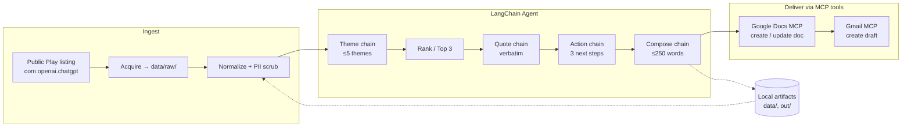
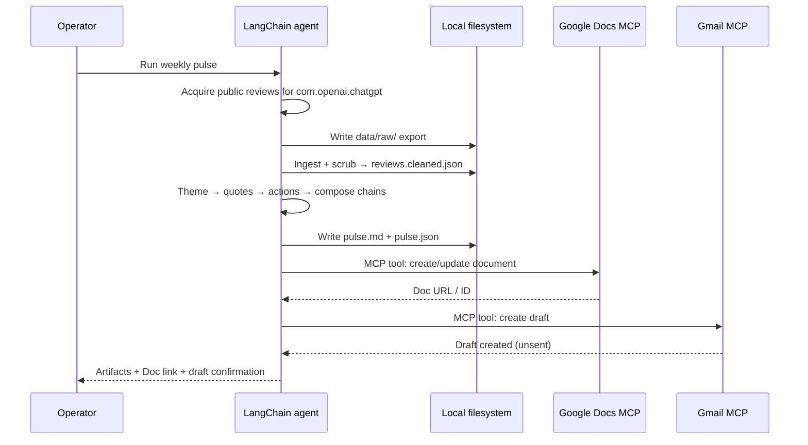
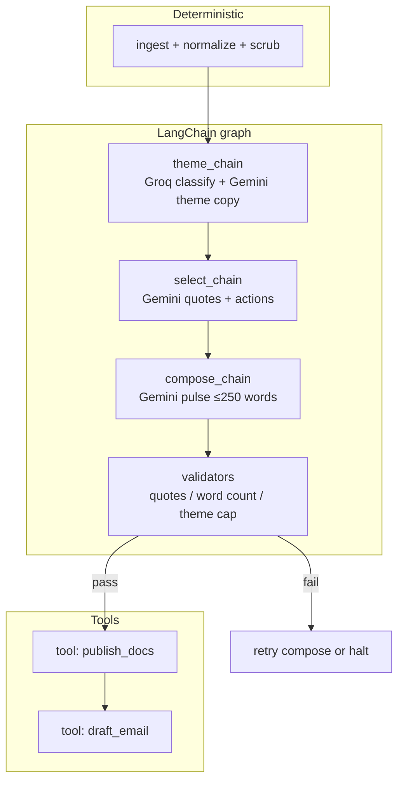
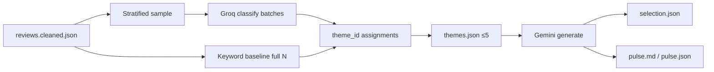
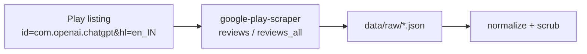
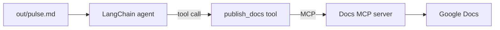
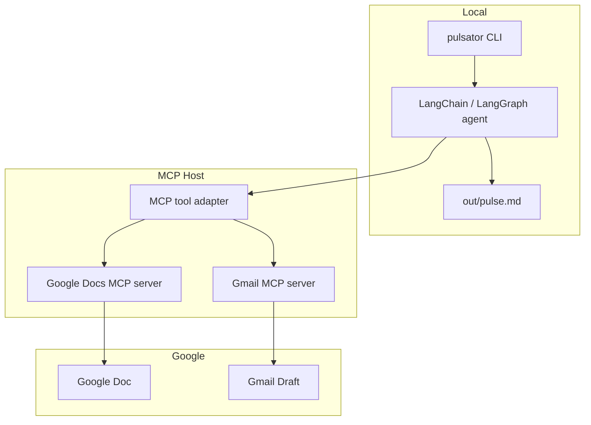

# AI Review Pulsator — Architecture

## 1. Purpose

**AI Review Pulsator** turns public Google Play reviews for the ChatGPT Android app into a **weekly one-page pulse** that Product, Support, and Leadership can scan in minutes.

| Input | Processing | Output |
| --- | --- | --- |
| Public Play Store reviews for ChatGPT (~8–12 weeks) | Aggregate → theme (≤5) → summarize | Google Doc pulse + Gmail draft |

**Non-goals:** scraping behind store logins, Play Console / developer-API access, bespoke Google OAuth/REST clients for Docs/Gmail, long reports, PII retention.

**Primary product:** [ChatGPT on Google Play](https://play.google.com/store/apps/details?id=com.openai.chatgpt&hl=en_IN) (`com.openai.chatgpt`).

### Where review data is fetched from

| Field | Value |
| --- | --- |
| **Listing URL** | https://play.google.com/store/apps/details?id=com.openai.chatgpt&hl=en_IN |
| **App / package ID** | `com.openai.chatgpt` |
| **Locale hint from URL** | `hl=en_IN` → fetch with language `en`, country/region `in` |
| **Data surface** | **Public** Google Play Store review feed for that listing (same reviews a visitor can read on the store page) |
| **Not used** | Google Play Console, Play Developer API, or any login-gated publisher backend (we do not own this app) |

**Acquire mechanism (v1):** the `acquire` stage calls a **public-listing reviews client** (recommended: Python [`google-play-scraper`](https://pypi.org/project/google-play-scraper/)) with `app_id=com.openai.chatgpt`, sorted by newest, paginated until the ~8–12 week window is covered (or a configured max count). Results are written to `data/raw/` before normalize/scrub.

**Fallback:** if live fetch is unavailable (network, rate limits), use a previously saved public export under `data/raw/` from the same listing — still no Console credentials.

---

## 2. Design Principles

1. **MCP-first delivery** — Google Docs and Gmail are reached only through MCP tool calls, not custom Google API SDKs.
2. **Public-data only** — reviews are fetched from the **public Play Store listing** for `com.openai.chatgpt` (or a saved export of that same public feed); never Play Console logins or other ToS-violating / credentialed store automation.
3. **Privacy by default** — strip usernames, emails, device IDs, and other identifiers before clustering or writing artifacts.
4. **Scannable pulse** — written note ≤250 words; top 3 themes, 3 verbatim quotes, 3 action ideas.
5. **Deterministic pipeline** — clear stages with typed artifacts so a weekly run is repeatable and inspectable.
6. **LangChain agent core** — LLM reasoning (theme → quotes → actions → compose) and tool use are built with **LangChain**; delivery still goes through MCP for Docs/Gmail.
7. **Agent-operable** — stages are runnable via CLI or a LangChain agent graph, not a heavy always-on service.

---

## 3. High-Level Architecture



### Runtime shape

| Layer | Role | Implementation intent |
| --- | --- | --- |
| **Data plane** | Files on disk (exports, cleaned reviews, pulse markdown/JSON) | `data/`, `out/` |
| **Compute plane** | Import, scrub (deterministic Python) | `src/ingest`, `src/privacy` |
| **Agent plane** | Theme, quote, action, compose + orchestration | **LangChain** (LCEL / LangGraph) |
| **Tool plane** | Publish Doc + create Gmail draft | MCP tool wrappers invoked by the LangChain agent |
| **Delivery plane** | Stakeholder-readable Doc + self draft email | Google Docs + Gmail via MCP |

There is **no** required always-on backend, database, or custom OAuth app for v1.

### Why LangChain fits

| Need | LangChain capability |
| --- | --- |
| Multi-step pulse generation | Chains / LangGraph nodes per stage (`theme` → `select` → `compose`) |
| Structured outputs | Pydantic / JSON schema parsers for themes, quotes, actions, `pulse.json` |
| Prompt management | `ChatPromptTemplate` + versioned prompts under `prompts/` |
| Tool calling for delivery | Bind MCP-backed tools (Docs create/update, Gmail draft) to the agent |
| Guardrails | Post-chain validators (quote substring check, ≤5 themes, ≤250 words) before tools run |
| Observability | LangSmith tracing (optional) for weekly run debugging |

**Boundary:** LangChain owns **reasoning and orchestration**. MCP owns **Google Docs/Gmail I/O**. Deterministic ingest/scrub stay outside the LLM when possible.

---

## 4. End-to-End Pipeline Stages



| Stage | ID | Responsibility | Primary artifact |
| --- | --- | --- | --- |
| 1. Acquire | `acquire` | Fetch public reviews from the ChatGPT Play listing (`com.openai.chatgpt`, `en`/`in`) via public-listing client; optional fallback to saved `data/raw/` | `data/raw/*` |
| 2. Normalize | `normalize` | Map heterogeneous export fields → canonical schema | `data/interim/reviews.normalized.json` |
| 3. Scrub | `scrub` | Remove/redact PII; drop empty text | `data/processed/reviews.cleaned.json` |
| 4. Theme | `theme` | Cluster into ≤5 themes; assign each review a theme label | `out/themes.json` |
| 5. Select | `select` | Choose Top 3 themes; pick 3 verbatim quotes; draft 3 actions | `out/selection.json` |
| 6. Compose | `compose` | Produce ≤250-word one-pager | `out/pulse.md`, `out/pulse.json` |
| 7. Publish | `publish_docs` | Create/update Google Doc via MCP | Doc ID + URL (logged) |
| 8. Notify | `draft_email` | Create Gmail draft via MCP containing note or Doc link | Draft ID (logged) |

Stages 1–3 are **deterministic Python** (no LLM required). Stages 4–6 are **LangChain LLM chains with a dual-provider split** (Groq classify / Gemini generate). Stages 7–8 are **LangChain tool calls** into MCP (require authenticated Google connectors).

---

## 5. LangChain Agent Architecture

The Pulsator agent is a **staged LangChain application**: deterministic prep, then an LLM graph, then MCP tool calls.



### 5.0 Agent building blocks

| Building block | Role in Pulsator |
| --- | --- |
| **LangGraph** (preferred) or LCEL pipeline | Explicit nodes for `theme`, `select`, `compose`, `validate`, `publish`, `draft_email`; easy to resume after human review |
| **Chat models (dual)** | **Groq** classifies reviews; **Gemini** generates theme copy, quotes, actions, pulse prose |
| **Structured output** | Themes / selection / pulse as Pydantic models → reliable `themes.json`, `selection.json`, `pulse.json` |
| **Tools** | Thin wrappers that invoke **Google Docs MCP** and **Gmail MCP** (or adapters that expose MCP tools to LangChain) |
| **Runnable bindings** | Pass `config.yaml` (lookback, caps, email_to) into each node |
| **Callbacks / LangSmith** | Optional traces per weekly run for debugging theme drift |

### Agent vs Cursor

| Mode | When |
| --- | --- |
| **LangChain CLI agent** (`pulsator run`) | Primary automation path for a full weekly run |
| **Cursor + MCP** | Dev, debugging, or manual republish if the LangChain process cannot reach MCP in a given environment |

Both paths must produce the same `out/pulse.*` contracts.

### 5.1 Dual-LLM provider split (locked for v1)

| Role | Provider | Model (default) | Env key | Used by |
| --- | --- | --- | --- | --- |
| **Classify** | **Groq** | `openai/gpt-oss-120b` | `GROQ_API_KEY` | `theme` — label stratified review batches into catalog `theme_id`s |
| **Generate** | **Gemini** | `gemini-2.5-flash` | `GEMINI_API_KEY` (or `GOOGLE_API_KEY`) | `theme` descriptions, `select` quotes+actions, `compose` / shorten |



**Why split:** Groq free-tier RPM/TPM is enough for **batch labeling** of a sample; Gemini is better suited for **stakeholder-facing prose** (theme blurbs, quote/action drafting, pulse compose). Deterministic keyword classification remains the offline fallback when keys are missing.

**Groq rate limits (configured):** 30 RPM · 1K RPD · 8K TPM · 200K TPD — enforce client-side throttle; never send the full ~9.4k corpus in one call (use `classify_sample_size` ≈ 900, `classify_batch_size` ≈ 20).

---

## 6. Logical Components

### 6.1 Review Ingestion (`ingest`)

**Responsibility:** Fetch (or load) public ChatGPT Play reviews and produce a normalized, PII-scrubbed review set.

#### Data source (authoritative)

```text
Source type:     Google Play Store — public app listing reviews
Listing URL:     https://play.google.com/store/apps/details?id=com.openai.chatgpt&hl=en_IN
App ID:          com.openai.chatgpt
Lang / country:  en / in   (from hl=en_IN)
Client:          google-play-scraper (or equivalent public-listing reviews API)
Auth:            none — no Google account, no Play Console
Landing path:    data/raw/play_reviews_<timestamp>.json
```



**Primary path — live public fetch**

1. Read `app_id`, `play_url`, `lang`, `country`, and `lookback_weeks` from config.  
2. Call the public reviews client for `com.openai.chatgpt` (newest first; paginate).  
3. Keep reviews whose dates fall in the ~8–12 week window.  
4. Persist the raw payload under `data/raw/` (for audit/replay), then normalize + scrub.

**Secondary path — saved public export**

- If live fetch fails or offline mode is set, load the latest matching file from `data/raw/` previously produced from the **same** listing.  
- Course fixtures are allowed for P0/dev only; production weekly runs should use live public fetch or a fresh saved export from that listing.

**Forbidden:** Play Console / Developer API (app not owned by us), login-gated scraping, inventing review text.

**Canonical review fields:**

```text
review_id      string   # opaque hash of source id or content+date; not a username
rating         int      # 1–5
title          string?  # optional
text           string   # review body (required after filter)
date           date     # ISO-8601 date
locale         string?  # e.g. en_IN
source_app_id  string   # com.openai.chatgpt
week_bucket    string   # derived YYYY-Www for aggregation
```

**Window:** keep reviews with `date` in approximately the last **8–12 weeks** relative to run date (configurable).

### 6.2 Privacy Scrubber (`privacy`)

**Responsibility:** Ensure no PII reaches themes, pulse, Docs, or email.

| Strip / redact | Examples |
| --- | --- |
| Reviewer identity | usernames, display names, emails |
| Contact & IDs | phone numbers, device IDs, order IDs if present |
| Accidental PII in body | emails/phones in free text → `[redacted]` |

Quotes in the pulse must remain **verbatim** after scrubbing (only identity-bearing tokens removed; wording otherwise unchanged). Never invent quotes.

### 6.3 Theme Clustering (`themes`) — LangChain chain

**Responsibility:** Group cleaned reviews into **at most 5** product-relevant themes.

**Data-adapted ChatGPT Play catalog (v1):**

1. Paywall / limits / subscription upgrade friction (`t_paywall`)  
2. Image & photo generation limits (`t_image`)  
3. Answer quality / misunderstandings (`t_quality`)  
4. Reliability / crashes / errors / broken updates (`t_reliability`)  
5. Login / account access (`t_login`)  
6. Praise / high satisfaction (`t_praise`) — tracked; **not** preferred for pulse Top 3  

(If the corpus supports fewer coherent pain themes, use fewer than 5. Never exceed 5 emitted themes.)

**Clustering approach (v1 — dual LLM):**

| Step | Who | What |
| --- | --- | --- |
| Keyword baseline | Deterministic catalog regex | Labels **all** cleaned reviews → full-N counts/shares offline-safe |
| **Groq classify** | `langchain.classify` → `openai/gpt-oss-120b` | Re-labels a **stratified sample** in batches; overrides baseline for those ids |
| Aggregate | Local Python | Build `ThemesResult` (≤5), complaint-weight for Top 3 |
| **Gemini enrich** | `langchain.generate` → `gemini-2.5-flash` | Rewrite theme **descriptions** from sample evidence |

| Option | When to use |
| --- | --- |
| **Groq labeling + Gemini descriptions** (above) | **Default** |
| Keyword-only | No `GROQ_API_KEY` / offline CI |
| Embedding hybrid | Only if Groq batch labels drift across weeks |

**Implementation sketch:**

- Input: cleaned corpus + stratified sample (oversample 1–3★ / longer reviews)  
- Groq prompt: catalog ids only; output `review_id → theme_id`  
- Gemini prompt: one-line product description per pain theme  
- Output: Pydantic `ThemesResult` → `out/themes.json`  

**Theme record:**

```text
theme_id       string
label          string
description    string
review_count   int
share          float    # review_count / total
avg_rating     float?
example_ids    string[] # cleaned review_ids
```

**Ranking for pulse:** sort pain themes by complaint-weighted score (not raw praise volume), take **Top 3**.

### 6.4 Quote Selector (`quotes`) — Gemini via `select_chain`

**Responsibility:** Pick **exactly 3** short, verbatim snippets that illustrate the Top 3 themes (ideally one per theme).

Rules:

- Must appear in cleaned review `text` after scrubbing  
- Prefer specificity over generic praise/complaint  
- Prefer mid-length snippets (readable in a one-pager)  
- No paraphrasing; truncate with ellipsis only if needed for length, without changing meaning  

**Provider:** **Gemini** (`langchain.generate`) proposes quotes from a **complaint-heavy candidate list** built locally. A **deterministic validator** rejects any quote that is not a substring of cleaned review text before compose/publish. Offline fallback: deterministic candidate picker.

### 6.5 Action Ideation (`actions`) — Gemini via `select_chain`

**Responsibility:** Propose **exactly 3** concrete next steps grounded in Top 3 themes.

Rules:

- Each action maps to at least one theme  
- Actionable for Product / Growth / Support (not vague “improve UX”)  
- No claim of internal roadmap knowledge; frame as hypotheses from reviews  

Combined with quotes in a single Gemini `select_chain` structured-output step. Offline fallback: catalog default action templates.

### 6.6 Pulse Composer (`compose`) — Gemini via `compose_chain`

**Responsibility:** Emit the weekly one-page note.

**Required sections:**

1. Header — product, window (date range), cleaned review count, coverage caveat if lookback incomplete  
2. Top themes — Top 3 with brief “why it matters”  
3. User quotes — 3 verbatim snippets  
4. Action ideas — 3 next steps  

**Hard limit:** ≤ **250 words** for the stakeholder-facing body (excluding optional machine metadata in `pulse.json`).

**Provider:** **Gemini** writes markdown; a post-chain word-count check retries once with a “shorten” prompt (also Gemini) or fails the run. Offline fallback: deterministic template compose.

**Outputs:**

- `out/pulse.md` — human-readable note used for Docs body  
- `out/pulse.json` — structured twin for logging, tests, and email templating  

### 6.7 Google Docs Publisher (`publish_docs`) — LangChain tool → MCP

**Responsibility:** Create or update a Google Doc with the pulse content.



**Patterns:**

- **Create** a new doc titled e.g. `ChatGPT Play Pulse — YYYY-Www`  
- Or **update** a standing “Weekly Pulse” doc by appending/replacing a section  

**Constraint:** the LangChain tool must call **MCP** (or an MCP adapter), not a first-party Google Docs REST client in app code.

### 6.8 Gmail Draft Creator (`draft_email`) — LangChain tool → MCP

**Responsibility:** Create an **unsent draft** to the operator or an alias.

**Body options (either acceptable):**

- Full pulse text inline, or  
- Short summary + **link/pointer** to the Google Doc  

**Constraint:** draft only (do not auto-send unless explicitly requested later). LangChain tool → MCP-first; no bespoke Gmail API client as primary path.

---

## 7. Data Architecture

### 7.1 Directory layout (proposed)

```text
AI-Review-Pulsator/
├── docs/
│   ├── problemStatement.md
│   └── architecture.md          # this file
├── data/
│   ├── raw/                     # public Play listing fetches (gitignored if large)
│   ├── interim/                 # normalized
│   └── processed/               # cleaned, ready for analysis
├── out/
│   ├── themes.json
│   ├── selection.json
│   ├── pulse.md
│   ├── pulse.json
│   └── run.log                  # doc/draft IDs, timestamps
├── src/
│   ├── ingest/                  # acquire (Play listing), normalize
│   ├── privacy/                 # deterministic scrub
│   ├── agent/                   # LangChain / LangGraph
│   │   ├── graph.py             # weekly pulse graph
│   │   ├── chains/              # theme, select, compose
│   │   ├── tools/               # MCP-backed publish_docs, draft_email
│   │   ├── schemas.py           # Pydantic structured outputs
│   │   └── validators.py        # quote / word-count / theme-cap gates
│   └── cli.py                   # typer entry: pulsator run
├── prompts/                     # ChatPromptTemplate source files
├── config.yaml
├── requirements.txt             # langchain, langgraph, pydantic, …
└── README.md
```

### 7.2 Artifact contracts

**`reviews.cleaned.json`**

```json
{
  "app_id": "com.openai.chatgpt",
  "window": { "start": "2026-06-18", "end": "2026-09-10" },
  "reviews": [
    {
      "review_id": "r_…",
      "rating": 2,
      "title": null,
      "text": "…",
      "date": "2026-08-21",
      "locale": "en_IN",
      "week_bucket": "2026-W34"
    }
  ]
}
```

**`pulse.json`**

```json
{
  "product": "ChatGPT (Android)",
  "app_id": "com.openai.chatgpt",
  "window": { "start": "…", "end": "…" },
  "generated_at": "…",
  "top_themes": [
    { "label": "…", "summary": "…", "review_count": 0 }
  ],
  "quotes": [
    { "text": "…", "theme": "…", "rating": 1 }
  ],
  "actions": [
    { "title": "…", "rationale": "…", "theme": "…" }
  ],
  "word_count": 0,
  "doc": { "id": null, "url": null },
  "email_draft": { "id": null }
}
```

### 7.3 Persistence philosophy

- v1 stores everything as **versionable files** (JSON/Markdown).  
- No DB required.  
- Treat `out/pulse.*` as the source of truth for a given weekly run; Docs/Gmail are delivery projections.

---

## 8. Integration Architecture (LangChain + MCP)



| Concern | Approach |
| --- | --- |
| Auth | Handled by MCP server / connector configuration in the environment |
| API surface | Only tools exposed by Docs & Gmail MCP servers |
| LangChain role | Binds those MCP capabilities as **tools** on the agent; does not embed Google OAuth/REST |
| App code | Produces content via chains; publish/draft only after validators pass |
| Failure mode | If MCP unavailable, graph still writes `out/pulse.*`; skip or soft-fail tool nodes |

**Publish sequence (LangChain tools):**

1. Graph writes `out/pulse.md` / `out/pulse.json`  
2. `publish_docs` tool → Docs MCP → create/update document → store URL/ID  
3. `draft_email` tool → Gmail MCP → create draft to self/alias → store draft ID  

---

## 9. Control Flow & Orchestration

### Weekly run (happy path)

1. Ensure config points at the ChatGPT listing (`app_id`, `play_url`, `lang`/`country`) and `acquire.mode` is `live` (or `file` with a fresh `data/raw/` export).  
2. `pulsator run` → acquire from public Play listing → scrub → LangGraph theme → select → compose → validate → (optional) publish + draft.  
3. Spot-check `out/pulse.md` (or pause graph on a human-review node before tools).  
4. Confirm Doc + Gmail draft IDs in `out/run.log`.  
5. Operator opens draft, edits if needed, sends manually.

### Configuration (suggested `config.yaml`)

```yaml
app_id: com.openai.chatgpt
play_url: https://play.google.com/store/apps/details?id=com.openai.chatgpt&hl=en_IN
# Derived from play_url hl=en_IN — public listing fetch parameters
lang: en
country: in
acquire:
  mode: live                  # live | file
  client: google-play-scraper # public Play listing reviews; no login
  sort: newest
  max_reviews: 2000           # safety cap while covering lookback window
  raw_glob: data/raw/play_reviews_*.json
lookback_weeks: 10            # within 8–12
max_themes: 5
pulse_top_themes: 3
pulse_quotes: 3
pulse_actions: 3
max_pulse_words: 250
email_to: "you@example.com"   # or alias
docs_title_template: "ChatGPT Play Pulse — {iso_week}"
langchain:
  tracing: false
  require_mcp: false
  classify_sample_size: 900
  classify_batch_size: 20
  classify:
    provider: groq
    model: openai/gpt-oss-120b
    temperature: 0
    requests_per_minute: 30
    requests_per_day: 1000
    tokens_per_minute: 8000
    tokens_per_day: 200000
  generate:
    provider: gemini
    model: gemini-2.5-flash
    temperature: 0.2
    requests_per_minute: 15
    requests_per_day: 1500
    tokens_per_minute: 1000000
    tokens_per_day: 10000000
```

Env secrets (never commit): `GROQ_API_KEY`, `GEMINI_API_KEY`.

---

## 10. Cross-Cutting Concerns

### 10.1 Privacy & compliance

- Scrub before any LangChain/LLM call that might log prompts externally when possible.  
- Never write reviewer names into Docs/email.  
- Prefer storing only scrubbed derivatives in git; keep raw exports local/gitignored if they contain identity fields.

### 10.2 Fidelity of quotes

- Unit/assertion tests: each pulse quote is a substring of some cleaned review text.  
- LangChain validator node rejects paraphrased model output before publish tools run.

### 10.3 Word budget

- Composer / validator counts words on the stakeholder body; fail or auto-trim if >250.  
- Prefer cutting theme prose before cutting quotes/actions structure.

### 10.4 Observability

- `out/run.log`: stage timestamps, counts in/out, theme sizes, word count, MCP IDs.  
- Optional **LangSmith** traces for chain/tool spans.  
- Exit non-zero if a hard constraint fails (0 reviews, >5 themes emitted, missing quotes, MCP publish failure when `require_mcp: true`).

### 10.5 Testing strategy

| Layer | What to test |
| --- | --- |
| Normalize | Field mapping from sample export fixtures |
| Scrub | Email/phone/username redaction |
| Themes | ≤5 themes; structured-output schema validity |
| Compose | Schema validity; word count; quote substring checks |
| LangChain graph | Node order; validator blocks tools on bad quotes |
| MCP tools | Smoke test with connectors enabled (or mocked tool adapters) |

---

## 11. Suggested Tech Stack (v1)

| Area | Choice | Rationale |
| --- | --- | --- |
| Language | **Python 3.11+** | First-class LangChain / LangGraph support |
| Review acquire | **`google-play-scraper`** against public listing `com.openai.chatgpt` | No Play Console; matches store URL in problem statement |
| Agent framework | **LangChain + LangGraph** | Staged chains, structured output, tool calling |
| Structured I/O | **Pydantic** (via LangChain) | Reliable `themes` / `selection` / `pulse` artifacts |
| CLI | `typer` | `pulsator run` stage/graph entrypoint |
| LLM — classify | **Groq** `openai/gpt-oss-120b` via `langchain-groq` | Batch theme labeling; free-tier RPM/TPM friendly |
| LLM — generate | **Gemini** `gemini-2.5-flash` via `langchain-google-genai` | Theme copy, quotes, actions, pulse prose |
| Delivery | Google Docs MCP + Gmail MCP (bound as LangChain tools) | Problem requirement; MCP-first |
| Config | YAML / `.env` | Dual endpoints, caps, email_to; secrets not in git |
| Tracing | LangSmith (optional) | Debug weekly runs |
| Secrets | MCP host for Google auth; `GROQ_API_KEY` + `GEMINI_API_KEY` in env only | No custom Google OAuth app |

**Not primary for v1:** TypeScript LangChain.js — same stage boundaries could port later, but Python + LangChain is the default architecture.

---

## 12. Threats, Risks & Mitigations

| Risk | Mitigation |
| --- | --- |
| ToS-violating / Console scrape temptation | Only public listing fetch for `com.openai.chatgpt` (or saved export of that feed); no Play Console |
| Hallucinated quotes | Substring validation gate before LangChain publish tools |
| Theme sprawl | Hard cap at 5 in prompt + schema; merge rare buckets |
| Overlong pulse | Enforced word count in compose/validator nodes |
| MCP auth / tool gaps | Local `out/pulse.md` always produced; tool nodes optional unless `require_mcp` |
| PII leakage | Scrub stage before LangChain calls + checklist before Doc/email |
| Prompt drift | Version prompts under `prompts/`; pin model in config |

---

## 13. Mapping to Problem Statement Success Criteria

| Success criterion | Architectural coverage |
| --- | --- |
| Import ~8–12 weeks of ChatGPT Play reviews | `acquire` from public listing URL/`com.openai.chatgpt` via `google-play-scraper` + normalize + lookback |
| Cluster into ≤5 themes | LangChain `theme_chain` + hard cap |
| One-pager: Top 3 themes, 3 quotes, 3 actions, ≤250 words | `select_chain` + `compose_chain` + validators |
| Publish to Google Docs via MCP | LangChain `publish_docs` tool → Docs MCP |
| Gmail draft via MCP | LangChain `draft_email` tool → Gmail MCP |
| No PII; no illicit scraping; MCP-first | `privacy` + design principles + MCP-only Google I/O |

---

## 14. Implementation Phases

| Phase | Outcome |
| --- | --- |
| **P0 — Skeleton** | Repo layout, `config.yaml`, sample fixtures, LangGraph stub + CLI |
| **P1 — Ingest & scrub** | Live/public fetch from Play listing → `data/raw/` → `reviews.cleaned.json` (no LLM) |
| **P2 — Dual-LLM pulse** | Groq classify + Gemini generate → `out/themes|selection|pulse.*` |
| **P3 — MCP tools** | Bind Docs + Gmail MCP as LangChain tools; log IDs |
| **P4 — Harden** | Quote/word-count tests, LangSmith optional, README runbook |

---

## 15. Operator Runbook (Summary)

1. Run acquire: pull public reviews for listing `com.openai.chatgpt` (`hl=en_IN` → `en`/`in`) into `data/raw/` (or `acquire.mode: file` on a saved export).  
2. Set `GROQ_API_KEY` + `GEMINI_API_KEY` in `.env`; ensure Docs/Gmail MCP connectors are available if publishing.  
3. Run `pulsator run --stage pulse`; open `out/pulse.md` and verify themes/quotes (Groq classify + Gemini generate).  
4. Confirm Google Doc + Gmail draft (or run with publish tools enabled).  
5. Review draft → send manually if ready.  

---

## 16. Open Decisions (to resolve during build)

1. Docs strategy: **new doc per week** vs single rolling doc.  
2. Email content: **full pulse** vs **Doc link only**.  
3. MCP ↔ LangChain bridge: environment-native MCP adapter vs thin subprocess/CLI wrappers around Cursor MCP tools.

**Resolved for this architecture:**

- **Python + LangChain** as the AI agent framework; Google Docs/Gmail **MCP-first**.  
- **Dual LLM:** **Groq** (`openai/gpt-oss-120b`) classifies reviews; **Gemini** (`gemini-2.5-flash`) generates theme copy, quotes, actions, and pulse prose. Keyword catalog is the offline fallback.  
- **LangGraph** for staged orchestration.  
- **Review data source:** public Google Play listing  
  https://play.google.com/store/apps/details?id=com.openai.chatgpt&hl=en_IN  
  fetched with **`google-play-scraper`** (app id `com.openai.chatgpt`, lang `en`, country `in`); fallback = saved export of that same public feed under `data/raw/`.

These remaining decisions do not change stage boundaries; they only affect implementations inside each component.
