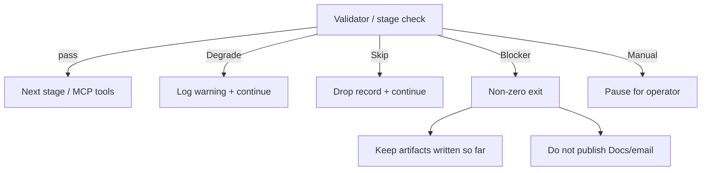

# AI Review Pulsator — Edge Cases

Corner scenarios derived from [`architecture.md`](./architecture.md) and [`implementation-plan.md`](./implementation-plan.md). Use this while building validators, tests (P4), and operator runbooks.

**Legend**

| Severity | Meaning |
| --- | --- |
| **Blocker** | Fail the run (non-zero exit); do not publish Docs/email |
| **Degrade** | Continue with fallback / reduced output; log clearly |
| **Skip** | Drop the offending record; continue |
| **Manual** | Operator decision required |

---

## 1. Acquire (Play listing fetch)

Source: public listing  
https://play.google.com/store/apps/details?id=com.openai.chatgpt&hl=en_IN  
via `google-play-scraper` (`com.openai.chatgpt`, `en` / `in`).

| ID | Scenario | Expected behavior | Severity |
| --- | --- | --- | --- |
| A1 | Live fetch fails (network timeout, DNS, TLS) | Retry with backoff; if still failing and a same-app `data/raw/` export exists, auto-fall back or instruct `acquire.mode: file`; else **Blocker** | Degrade → Blocker |
| A2 | Rate limit / HTTP 429 / temporary Play block | Backoff + retry; fall back to last good raw export; log rate-limit event | Degrade |
| A3 | Scraper returns empty list | **Blocker** — do not invent reviews; do not run theme/compose | Blocker |
| A4 | Pagination stops before lookback window is covered (`max_reviews` hit) | Log under-coverage warning with oldest date fetched; proceed if ≥ configured minimum count, else **Blocker** or Manual | Degrade / Blocker |
| A5 | All fetched reviews are older than lookback window | Cleaned set empty → **Blocker** (same as zero in-window reviews) | Blocker |
| A6 | `acquire.mode: file` but no matching `data/raw/play_reviews_*.json` | **Blocker** with clear path/glob message | Blocker |
| A7 | File-mode raw export is for a different `app_id` | Reject file; **Blocker** (do not mix apps) | Blocker |
| A8 | File-mode export is stale (e.g. older than lookback relative to run date) | Warn; proceed only if enough in-window rows remain after filter, else **Blocker** | Degrade / Blocker |
| A9 | Partial page / malformed JSON from scraper | Discard bad page or fail acquire; never write corrupt raw as “success” | Blocker |
| A10 | Wrong `lang`/`country` vs intended `hl=en_IN` | Config validation warning; prefer `en`/`in` from `play_url` | Degrade |
| A11 | Operator attempts Play Console / authenticated scrape | Out of scope — refuse in docs/code paths; only public listing client | Blocker (policy) |

**Minimum corpus (config suggestion):** e.g. `min_reviews_after_window: 15` (tune in P1/P4). Below that → Blocker or Manual.

---

## 2. Normalize

| ID | Scenario | Expected behavior | Severity |
| --- | --- | --- | --- |
| N1 | Missing `content` / empty text | Drop review in scrub/normalize | Skip |
| N2 | Missing `score` / non 1–5 rating | Skip or clamp only if recoverable; prefer Skip | Skip |
| N3 | Missing / unparseable timestamp (`at`) | Skip (cannot apply lookback) | Skip |
| N4 | Timezone / epoch vs datetime string drift | Normalize to UTC date (ISO-8601 date); document assumption | Degrade |
| N5 | Duplicate `reviewId` across pages | Dedupe by source id or content+date hash | Skip (dup) |
| N6 | Title-only review (no body) | Treat as empty text unless title alone is allowed; default **Skip** | Skip |
| N7 | Extremely long review body | Keep full text in cleaned set; quote selector must snip later | Degrade |
| N8 | Non-English text despite `lang=en` | Keep if returned by listing; theme chain must still label; do not invent translation as “quote” | Degrade |
| N9 | Scraper field rename / schema drift | Fail normalize with field errors; pin client version; update mapper | Blocker |
| N10 | `lookback_weeks` outside 8–12 | Config validation warning; clamp or reject invalid config | Degrade / Blocker |

---

## 3. Privacy scrub

| ID | Scenario | Expected behavior | Severity |
| --- | --- | --- | --- |
| P1 | `userName` / display name present on raw | Strip; never copy into cleaned JSON, themes, pulse, Docs, or email | Skip field |
| P2 | Email / phone in review body | Replace with `[redacted]`; keep rest of wording for quote fidelity | Degrade (text) |
| P3 | Quote becomes empty or meaningless after redaction | Do not use that review for pulse quotes; pick another | Skip |
| P4 | Device ID / order ID / support ticket patterns | Redact | Degrade (text) |
| P5 | Scrub changes text so substring check must use **cleaned** corpus | Validators always compare quotes to cleaned `text`, not raw | — |
| P6 | Raw export committed to git with usernames | Prevent via `.gitignore` + runbook; prefer scrubbed-only in VCS | Manual |
| P7 | LLM prompt accidentally includes raw (pre-scrub) batch | Pipeline must only pass cleaned reviews into LangChain nodes | Blocker if detected |

---

## 4. Theme clustering (≤5)

| ID | Scenario | Expected behavior | Severity |
| --- | --- | --- | --- |
| T1 | Model returns >5 themes | Validator rejects; merge rare into nearest or re-prompt once; then **Blocker** | Degrade → Blocker |
| T2 | Only 1–2 coherent themes in corpus | Allow fewer than 5; pulse Top N = `min(3, theme_count)` — see T8 | Degrade |
| T3 | Every review is generic (“great app”) | Still produce ≤5 themes; actions stay hypothesis-level; log low-signal warning | Degrade |
| T4 | Batching: different batches invent inconsistent labels | Canonicalize labels (catalog + merge map) before counts | Degrade |
| T5 | Unlabeled / “Other” mass | Fold “Other” into nearest catalog theme; do not emit 6th theme | Degrade |
| T6 | Theme counts do not sum to cleaned review count | Recompute from assignments; fail if gap > tolerance | Blocker |
| T7 | Structured-output parse failure | Retry once; then **Blocker** | Degrade → Blocker |
| T8 | Fewer than 3 themes total | Pulse uses all available themes; still require 3 quotes and 3 actions if possible, or relax quotes to `theme_count` with logged deviation — **default: require 3 quotes from available themes (repeat theme allowed once)**; document choice in config | Manual / Degrade |
| T9 | Tie for Top 3 (equal counts) | Deterministic tie-break (e.g. lower avg rating first, then label alpha) | Degrade |

---

## 5. Quotes (verbatim, exactly 3)

| ID | Scenario | Expected behavior | Severity |
| --- | --- | --- | --- |
| Q1 | Model paraphrases / invents quote | Substring validator fails; re-select or **Blocker** — never publish | Blocker |
| Q2 | Quote is substring of raw but not cleaned (PII removed) | Fail; must match cleaned text | Blocker |
| Q3 | Fewer than 3 reviews with usable text | **Blocker** (cannot meet deliverable) | Blocker |
| Q4 | All strong quotes sit in one theme | Prefer one per Top theme; if impossible, allow 2 from one theme + log imbalance | Degrade |
| Q5 | Quote too long for one-pager | Truncate with ellipsis **only** if truncated form remains a prefix/substring of cleaned text; else pick shorter quote | Degrade |
| Q6 | Quote is only emoji / single word | Reject; pick more specific snippet | Skip |
| Q7 | Same review used for all 3 quotes | Reject duplicates; require 3 distinct `review_id`s | Blocker |
| Q8 | Whitespace / Unicode normalization mismatch (smart quotes) | Normalize for comparison (NFKC, unify quotes) or fail closed | Degrade / Blocker |

---

## 6. Actions (exactly 3)

| ID | Scenario | Expected behavior | Severity |
| --- | --- | --- | --- |
| X1 | Vague actions (“improve UX”) | Prompt + optional quality check; prefer regenerate once | Degrade |
| X2 | Action claims internal roadmap / “OpenAI will…” | Reject / rewrite as review-grounded hypothesis | Degrade |
| X3 | Action not mapped to any Top theme | Reject structured output; regenerate | Blocker |
| X4 | Fewer than 3 actions returned | Regenerate; then **Blocker** | Blocker |
| X5 | Duplicate actions | Dedupe / regenerate | Degrade |

---

## 7. Compose (≤250 words)

| ID | Scenario | Expected behavior | Severity |
| --- | --- | --- | --- |
| C1 | Body >250 words | One shorten retry; then **Blocker** | Degrade → Blocker |
| C2 | Missing required section (header / themes / quotes / actions) | **Blocker** | Blocker |
| C3 | Compose invents a 4th quote or alters quote text | Validator compares to `selection.json`; **Blocker** | Blocker |
| C4 | Word count includes YAML/metadata accidentally | Count only stakeholder body in `pulse.md`; exclude machine fields in `pulse.json` | — |
| C5 | Markdown tables / long lists blow budget | Prompt for prose bullets; shorten retry strips fluff first, not quotes | Degrade |
| C6 | Empty `pulse.md` after “success” | **Blocker** | Blocker |
| C7 | `pulse.json` schema mismatch vs `pulse.md` | Prefer structured source of truth; regenerate md from json or fail | Blocker |

---

## 8. LangChain / LLM runtime

| ID | Scenario | Expected behavior | Severity |
| --- | --- | --- | --- |
| L1 | Missing LLM API key | **Blocker** before theme (ingest may still succeed if run staged) | Blocker |
| L2 | Provider 5xx / timeout mid-graph | Retry node; checkpoint artifacts written so far; fail closed on publish | Degrade → Blocker |
| L3 | Token limit on large review batch | Smaller batches; summarize counts locally; never drop scrub requirement | Degrade |
| L4 | Model returns invalid JSON / schema | Retry with stricter parser; then **Blocker** | Degrade → Blocker |
| L5 | LangSmith enabled but unreachable | Do not fail the pulse; log tracing skip | Degrade |
| L6 | Human-review pause node: operator rejects pulse | Do not call MCP tools; keep `out/pulse.*` for edit | Manual |

---

## 9. MCP delivery (Docs + Gmail)

| ID | Scenario | Expected behavior | Severity |
| --- | --- | --- | --- |
| M1 | Docs MCP unavailable; `require_mcp: false` | Soft-fail publish; keep local pulse; exit 0 with warning | Degrade |
| M2 | Docs MCP unavailable; `require_mcp: true` | **Blocker** after local pulse written | Blocker |
| M3 | Gmail MCP fails after Docs succeeds | Log Doc ID; soft-fail or Blocker per `require_mcp`; do not send email | Degrade / Blocker |
| M4 | Draft created but wrong `email_to` | Config validation; dry-run preview address in log | Manual |
| M5 | Accidental send vs draft | Tools must create **draft only**; never call send APIs | Blocker (policy) |
| M6 | Doc update on missing rolling-doc ID | Create new doc; log strategy fallback | Degrade |
| M7 | Pulse contains PII that slipped scrub | Pre-publish privacy checklist / scan; abort publish | Blocker |
| M8 | Cursor manual republish vs LangChain tools produce different bodies | Both must read same `out/pulse.md` | Degrade |
| M9 | MCP auth expired mid-run | Soft-fail tools; operator re-auth; local artifacts retained | Degrade |
| M10 | Email body too large if full pulse inline | Prefer Doc link + short summary (default decision) | Degrade |

---

## 10. Config & CLI

| ID | Scenario | Expected behavior | Severity |
| --- | --- | --- | --- |
| K1 | `app_id` ≠ `com.openai.chatgpt` while `play_url` points at ChatGPT | Config consistency check; **Blocker** on mismatch | Blocker |
| K2 | `acquire.mode` invalid | **Blocker** on startup | Blocker |
| K3 | `--stage compose` without cleaned reviews / themes | **Blocker** with dependency message | Blocker |
| K4 | Parallel two runs writing same `out/` | Document single-writer; optional run-id subfolder later | Manual |
| K5 | `max_pulse_words` set >250 | Warn — problem statement cap is 250; clamp to 250 | Degrade |

---

## 11. Data quality & product-specific content

| ID | Scenario | Expected behavior | Severity |
| --- | --- | --- | --- |
| D1 | Spike of off-topic / spam / competitor reviews | Theme as noise or merge; do not let spam dominate Top 3 without log flag | Degrade |
| D2 | Review about ChatGPT web/iOS while listing is Android | Keep (user signal); actions stay Android-app scoped where possible | Degrade |
| D3 | Sudden rating-bomb / coordinated short reviews | Note volume anomaly in run.log; still theme honestly | Degrade |
| D4 | Mixed languages in `country=in` feed | Keep; quotes must stay verbatim in original language | Degrade |
| D5 | Developer replies present in scraper payload | Ignore reply text for theming/quotes unless explicitly modeled | Skip |

---

## 12. End-to-end composites

| ID | Scenario | Expected behavior | Severity |
| --- | --- | --- | --- |
| E1 | Live acquire fails → file fallback → successful pulse → MCP soft-fail | Exit with warnings; local pulse OK; Doc/draft missing | Degrade |
| E2 | Cleaned reviews OK → quote validator fails twice | **Blocker**; no MCP; leave `themes.json` for debug | Blocker |
| E3 | Valid pulse → Docs OK → Gmail draft OK → operator edits Doc later | Email may be stale; draft should link Doc (preferred) so Doc is source of truth | Degrade |
| E4 | Re-run same ISO week | New raw file + overwrite or versioned `out/`; Docs: new weekly title or update rolling — per locked P3 decision | Manual |
| E5 | Zero in-window reviews after scrub | **Blocker** before any LLM spend | Blocker |

---

## Severity → pipeline policy

**Hard blockers (never publish):** empty corpus, hallucinated quotes, >5 themes unrepaired, missing 3 actions/quotes when required, word count >250 after retry, privacy failure, `require_mcp: true` with MCP errors.

---

## Suggested test fixtures (P4)

| Fixture | Covers |
| --- | --- |
| `raw_empty.json` | A3 |
| `raw_all_old.json` | A5 |
| `raw_with_pii.json` | P1–P3, Q2 |
| `raw_dup_ids.json` | N5 |
| `cleaned_two_themes.json` | T2, T8 |
| `selection_paraphrase.json` | Q1 |
| `pulse_300_words.md` | C1 |
| Mock MCP down | M1–M3 |

---

## Traceability

| Area | Architecture / plan anchors |
| --- | --- |
| Acquire / fallback | Architecture §1 data source; Plan “Review data source”; P1 risks |
| Scrub / PII | Architecture §6.2, §10.1; Plan guiding rules |
| Theme / quote / word caps | Architecture §6.3–6.6, §10.2–10.3; Plan P2 validators |
| MCP soft vs hard fail | Architecture §8 failure mode; `require_mcp`; Plan P3 |
| Exit codes | Architecture §10.4 |

---

## When implementing

1. Encode **Blocker** cases as automated tests before enabling MCP tools.  
2. Log every **Degrade** with a stable reason code in `out/run.log`.  
3. Keep this file updated when a new production incident appears.
