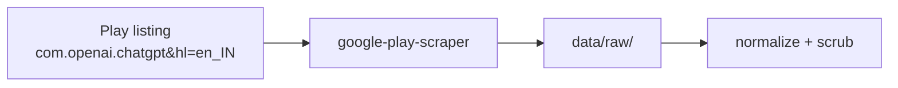
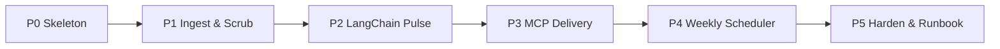

# AI Review Pulsator — Phase-Wise Implementation Plan

## Purpose

This plan turns [`problemStatement.md`](./problemStatement.md) and [`architecture.md`](./architecture.md) into an executable build sequence.

**Outcome at the end of all phases:** a Python + LangChain weekly runner that **fetches public reviews from the ChatGPT Google Play listing** ([store link](https://play.google.com/store/apps/details?id=com.openai.chatgpt&hl=en_IN), app id `com.openai.chatgpt`), themes them (≤5), writes a ≤250-word pulse (Top 3 themes, 3 verbatim quotes, 3 actions), publishes it to Google Docs via MCP, and creates a Gmail draft via MCP — on a **scheduled weekly cadence** — with no PII and no Play Console / login-gated scraping.

---

## Review data source (locked)

| Item | Detail |
| --- | --- |
| **Where** | Public Google Play Store listing for ChatGPT |
| **URL** | https://play.google.com/store/apps/details?id=com.openai.chatgpt&hl=en_IN |
| **App ID** | `com.openai.chatgpt` |
| **Locale** | From `hl=en_IN` → language `en`, country `in` |
| **How (P1+)** | `acquire` stage using **`google-play-scraper`** (public reviews client; **no Google login**, **not** Play Console / Developer API) |
| **Sort / window** | Newest first; keep ~8–12 weeks per `lookback_weeks` |
| **Persisted raw** | `data/raw/play_reviews_<timestamp>.json` |
| **Fallback** | `acquire.mode: file` → latest saved export from the **same** listing under `data/raw/` |
| **P0 only** | Small fixture under `data/raw/` for scaffolding; replace with live public fetch in P1 |



---

## Guiding Rules (apply every phase)

| Rule | Source |
| --- | --- |
| Public reviews only from the ChatGPT Play **listing** (URL/`com.openai.chatgpt` above) — no Play Console | Problem constraints + architecture |
| MCP-first Docs & Gmail (no custom Google OAuth/REST as primary path) | Problem + architecture |
| LangChain / LangGraph for theme → select → compose + tool orchestration | Architecture |
| Deterministic ingest/scrub before any LLM call | Architecture |
| Hard caps: ≤5 themes, Top 3 in pulse, 3 quotes, 3 actions, ≤250 words | Problem + architecture |
| Quotes must be verbatim substrings of cleaned review text | Architecture validators |

**Default stack:** Python 3.11+, LangChain + LangGraph, Pydantic, Typer CLI, YAML config.

---

## Phase Overview



| Phase | Goal | Unlocks success criteria |
| --- | --- | --- |
| **P0** | Repo, config, fixtures, CLI/graph stub | Foundation for all work |
| **P1** | Fetch from public Play listing + scrub → cleaned corpus | Import reviews; privacy baseline |
| **P2** | Dual-LLM pulse (Groq classify + Gemini generate) on cleaned corpus | Themes ≤5; one-pager with quotes/actions |
| **P3** | Docs + Gmail via MCP tools | Publish Doc; draft email |
| **P4** | Weekly cron that runs full pipeline unattended | Recurring acquire → classify → pulse → Doc + email |
| **P5** | Tests, observability, operator docs | Full checklist reliability |

**Suggested sequencing:** finish each phase’s exit criteria before starting the next. P3 can be prototyped in parallel with late P2 only if `out/pulse.md` contracts are already stable. Start **P4 only after** live P3 smoke (Doc append + Gmail draft) succeeds.

---

## P0 — Skeleton

### Objective

Stand up a runnable project shell so every later stage has a place to live.

### Scope

**In**

- Directory layout per architecture (`data/`, `out/`, `src/ingest`, `src/privacy`, `src/agent`, `prompts/`)
- `config.yaml` with `play_url`, `app_id` (`com.openai.chatgpt`), `lang`/`country` (`en`/`in`), `acquire` block (`mode`, `client: google-play-scraper`), lookback, caps, email placeholder, LangChain block
- `.env.example` for LLM API key (no secrets committed)
- `.gitignore` for `.env`, large/raw exports, optional `out/` noise
- Sample fixture reviews under `data/raw/` (synthetic or anonymized public-shaped data) for offline P0 only — live listing fetch comes in P1
- Typer CLI: `pulsator run` / `pulsator run --stage <id>` stubs
- LangGraph stub with node placeholders: `ingest` → `theme` → `select` → `compose` → `validate` → `publish` → `draft_email`
- Pydantic schema stubs matching `themes.json` / `selection.json` / `pulse.json`
- Minimal `README.md` (install + “not ready” note; document the Play listing URL as the future data source)
- `requirements.txt` / lockfile skeleton (`langchain`, `langgraph`, `pydantic`, `typer`, `pyyaml`, `google-play-scraper`, …)

**Out**

- Real LLM calls, MCP calls, production review acquisition

### Tasks

1. Create repo structure and empty `__init__.py` modules.
2. Add `config.yaml` + config loader.
3. Add fixture JSON/CSV shaped like Play export fields (`rating`, `title`, `text`, `date`, …).
4. Wire CLI to invoke graph stub (nodes can no-op or write placeholder files).
5. Document stage IDs: `acquire`, `normalize`, `scrub`, `theme`, `select`, `compose`, `publish_docs`, `draft_email`.

### Exit criteria

- [ ] `pulsator run --help` works in a clean venv
- [ ] Config loads; fixture path resolves
- [ ] Graph stub executes end-to-end without LLM/MCP and exits 0
- [ ] Schema modules import; artifact paths documented

### Decision checkpoint

- Confirm **LangGraph** (preferred) vs pure LCEL for the stub — pick one and stick through P2.

---

## P1 — Ingest & Scrub

### Objective

Produce `data/processed/reviews.cleaned.json` for `com.openai.chatgpt` covering roughly the last **8–12 weeks**, with PII removed — no LLM required.

Reviews are fetched from the **public** Play Store listing:

https://play.google.com/store/apps/details?id=com.openai.chatgpt&hl=en_IN

### Scope

**In**

- **`acquire` (primary):** live fetch via **`google-play-scraper`** using `app_id=com.openai.chatgpt`, `lang=en`, `country=in` (from `hl=en_IN`); newest-first pagination; write raw JSON to `data/raw/`
- **`acquire` (fallback):** `mode: file` loads a prior public export from `data/raw/` for the same app id
- Explicit **non-sources:** Google Play Console, Play Developer API, any Google-account login to the store
- `normalize`: map scraper/export fields → canonical review schema (`review_id`, `rating`, `title`, `text`, `date`, `locale`, `source_app_id`, `week_bucket`)
- Lookback filter from `config.lookback_weeks` (default within 8–12)
- `scrub`: strip usernames, emails, phones, device IDs; redact PII-like tokens in body; drop empty text
- Write `data/interim/reviews.normalized.json` and `data/processed/reviews.cleaned.json`
- Unit tests for normalize + scrub; smoke test that acquire returns reviews for `com.openai.chatgpt` (or skips live call in CI with file mode)
- CLI stages: `--stage acquire`, `--stage normalize`, `--stage scrub`, or ingest bundle
- Document the listing URL + client in README acquire notes

**Out**

- Theming, pulse writing, MCP

### Tasks

1. Add `google-play-scraper` (or pinned equivalent) to dependencies.
2. Implement `acquire` against the ChatGPT listing; persist `data/raw/play_reviews_<timestamp>.json`.
3. Implement normalize + date windowing from raw scraper fields (`score`→`rating`, `content`→`text`, `at`→`date`, etc.).
4. Implement privacy scrubber + opaque `review_id` (hash; never username — scraper may return `userName` that must be dropped).
5. Log counts: fetched → in-window → cleaned; window start/end; source URL/app id.
6. Add tests with planted emails/phones/usernames; optional recorded raw fixture for offline normalize tests.

### Exit criteria

- [ ] Live acquire (or documented file fallback) yields reviews for `com.openai.chatgpt` from the public listing
- [ ] Raw landing file exists under `data/raw/` with provenance (app id, lang/country, fetch time)
- [ ] Cleaned file exists with reviews only inside the configured window
- [ ] No usernames/emails/device IDs in cleaned artifact (spot-check + tests)
- [ ] Empty-body reviews excluded
- [ ] Success criterion progress: **reviews imported for ~8–12 weeks** from the Play listing URL

### Decision checkpoint

- Acquire mechanism is **locked**: public listing + `google-play-scraper`; only toggle `live` vs `file` mode.

### Risks

| Risk | Mitigation |
| --- | --- |
| Temptation to use Play Console / login scrape | Config and docs name only the public listing URL + scraper client |
| Rate limits / fetch failures | Retry/backoff; fall back to last good `data/raw/` export |
| Sparse window | Raise `max_reviews` / paginate until lookback covered |
| Scraper field drift | Fixture + normalize tests; pin client version |

---

## P2 — LangChain Pulse Generation (dual LLM)

### Objective

From the **Phase-1 cleaned corpus**, run LangChain chains to emit a valid local weekly pulse: `out/themes.json`, `out/selection.json`, `out/pulse.md`, `out/pulse.json`.

**Primary inputs (locked for this phase):**

| Artifact | Path | Role |
| --- | --- | --- |
| Cleaned JSON | `data/processed/reviews.cleaned.json` | Canonical input to `theme` / `select` / `compose` |
| Cleaned CSV | `data/processed/reviews.cleaned.csv` | Same rows (flat); useful for spot-checks, spreadsheets, offline QA |

Do **not** re-read raw Play exports in P2 — only scrubbed, English, ≥8-word reviews.

### Dual-LLM split (locked)

| Role | Provider | Model | Env | Stage responsibility |
| --- | --- | --- | --- | --- |
| **Classify** | **Groq** | `openai/gpt-oss-120b` | `GROQ_API_KEY` | Batch-label stratified reviews into catalog `theme_id`s |
| **Generate** | **Gemini** | `gemini-2.5-flash` | `GEMINI_API_KEY` | Theme descriptions, **user quotes**, **action ideas**, pulse compose/shorten |

Groq free-tier caps (also in `config.yaml`): **30 RPM · 1K RPD · 8K TPM · 200K TPD**. Client throttle + `classify_sample_size` (~900) / `classify_batch_size` (~20) keep classification inside those limits.

Offline / CI: keyword catalog classification + template quotes/actions/compose still produce valid artifacts when keys are missing.

### When to re-run which phase

| Phase | Re-run needed for this dual-LLM change? | Why |
| --- | --- | --- |
| **P0** | No | Scaffold unchanged |
| **P1** | **No** | Cleaned corpus (`reviews.cleaned.json` / `.csv`) is unchanged |
| **P2** | **Yes** | Themes / selection / pulse were produced without Groq+Gemini split; re-run `pulsator run --stage pulse` after keys are set |
| **P3** | N/A until started | Will consume regenerated `out/pulse.*` |
| **P4** | After P3 live smoke | Schedule full `pulsator run` weekly |
| **P5** | Later | Add dual-provider smoke tests when hardening |

### Phase-1 corpus snapshot (as of cleaned export)

Use these facts to size prompts, sampling, and pulse framing. Recompute counts from the CSV/JSON if the corpus is refreshed.

| Metric | Value |
| --- | --- |
| Cleaned reviews | **9,428** (from 89,800 in-window after `<8` words + non-English drops) |
| Date span in corpus | **2026-08-26 → 2026-09-09** (~15 days; ISO weeks **2026-W35…W37**) |
| Target lookback | 8 weeks (`2026-07-16 → 2026-09-10`) — **not fully covered yet** (public feed rate limits) |
| Rating mix | **5★ 64.1%** · 4★ 12.3% · 3★ 6.1% · 2★ 3.4% · **1★ 14.1%** |
| Signal vs praise | **76.4%** are 4–5★; **23.6%** are 1–3★ (~2,223) — complaint signal is the minority |
| Length | median **14** words · mean **~22** · p90 **~47** (short bodies; quotes must stay short) |
| Volume by week | W35 ≈2.4k · W36 ≈5.1k · W37 ≈2.0k |

**Observed complaint / theme signals** (keyword scan on cleaned text; guide the v1 catalog, not hard labels):

| Likely theme | Rough signal | Notes from reviews |
| --- | --- | --- |
| **Paywall / usage limits / upgrade pressure** | ~13% of corpus; ~23% of 1–3★ | Free-tier chat/photo caps; Plus/Go/Pro upgrade nags |
| **Image / photo generation limits** | ~12% of corpus | Overlaps paywall; “limited photo system”, can’t upload after N messages |
| **Answer quality / misunderstanding** | ~5% overall; strong in 1★ | Wrong answers, flip-flopping when corrected, “doesn’t understand” |
| **Reliability / bugs / crashes / errors** | ~2–3% | Crashes, buggy UI after updates, device-validation failures |
| **Login / account access** | ~2% overall; concentrated in 1★ | Google sign-in loops, reload forever, can’t enter account |
| **Praise / generic usefulness** | ~37% hit praise words | Study help, “best app” — must **not** dominate Top 3 product themes |

Voice-mode and pure UX/onboarding appear, but smaller than the five rows above. Prefer **≤5 product themes**; fold rare labels into nearest.

### Scope

**In**

- Load cleaned reviews from `reviews.cleaned.json` (CSV is parity export only)
- **Stratified sampling before Groq classify** (required at this volume + TPM):
  - Do **not** send all 9,428 texts to Groq
  - Oversample **1–3★** and longer reviews for classification
  - Cap labeled rows per run via `classify_sample_size` (default **900**), batched at `classify_batch_size` (**20**)
  - Keyword baseline still labels the **full** cleaned N so `share` / counts stay corpus-wide; Groq overrides the sample
- `theme_chain`:
  - **Groq** → catalog `theme_id` assignment on sample
  - Aggregate ≤5 themes → `out/themes.json`
  - **Gemini** → enrich theme descriptions
- **Data-adapted theme catalog (v1 default)**:
  1. Paywall / limits / subscription upgrade friction  
  2. Image & photo generation limits  
  3. Answer quality / model misunderstandings  
  4. Reliability / crashes / errors / broken updates  
  5. Login / account access  
  - Optional merge bucket: **Praise / high satisfaction** (track share, but pulse Top 3 should prioritize **pain themes**)
- Rank Top 3 by **complaint-weighted** score (not raw praise volume)
- `select_chain` (**Gemini**): Top 3 themes, **3 verbatim quotes**, 3 action ideas → `out/selection.json`
  - Quote pool: prefer **1–3★**, ≥12 words, coherent English; reject emoji-spam / gibberish candidates
  - Prefer one quote per Top-3 theme; must be substring of cleaned `text`
- `compose_chain` (**Gemini**): one-page note ≤250 words → `out/pulse.md` + `out/pulse.json`
  - Header must state **actual corpus window** and cleaned N, plus coverage caveat if lookback incomplete
- Versioned prompts under `prompts/` (`classify_batch.txt`, `theme_enrich.txt`, `select_generate.txt`, `compose*.txt`)
- Validators (hard gates before any publish):
  - theme count ≤ 5
  - exactly 3 quotes; each is substring of some cleaned review text
  - exactly 3 actions mapped to themes
  - word count ≤ 250 on stakeholder body
- Optional one Gemini retry on compose if over word budget
- CLI/graph path: `theme` → `select` → `compose` → `validate` (bundle: `--stage pulse`)
- `out/run.log` with corpus stats, classify/generate provider+model, theme counts

**Out**

- Live Google Docs / Gmail (stubs/mocks only if needed)
- Re-fetch / re-scrub of Play data (that remains P1)

### Tasks

1. Add cleaned-corpus loader + corpus stats logging.
2. Implement stratified sampler sized for the **~9.4k** cleaned set / Groq TPM.
3. Implement Pydantic models for theme / selection / pulse contracts.
4. Wire **dual LLM clients**: `get_classify_model` (Groq) + `get_generate_model` (Gemini) with per-endpoint RPM throttle.
5. Build `theme_chain`: keyword baseline + **Groq batch classify** + **Gemini description enrich** → `out/themes.json`.
6. Build `select_chain`: **Gemini** generates quotes + actions from candidate pool (deterministic fallback).
7. Build `compose_chain`: **Gemini** pulse + shorten retry; template fallback.
8. Implement validators; fail run on violation when not recoverable.
9. Wire LangGraph nodes; support `--stage pulse` offline on cleaned files.
10. Manual quality pass once both API keys are set; compare vs prior keyword-only pulse.

### Exit criteria

- [ ] `pulsator run --stage pulse` works on `data/processed/reviews.cleaned.json` without re-acquiring
- [ ] With keys set: run log shows `classify=groq/openai/gpt-oss-120b` and `generate=gemini/gemini-2.5-flash`
- [ ] Produces all four `out/` artifacts
- [ ] ≤5 themes; pulse highlights Top 3 **pain-weighted** themes
- [ ] 3 quotes pass substring validation; 3 grounded actions
- [ ] Pulse body ≤250 words and states actual date span + cleaned review count
- [ ] Known gap documented: corpus may be **~15 days**, not full 8–12 weeks yet
- [ ] Without keys: deterministic fallback still exits 0 (CI)

### Decision checkpoint

- **Locked:** Groq classifies; Gemini generates (themes copy / quotes / actions / compose).
- Ranking: complaint-weighted Top 3 for stakeholder pulse.
- Confirm pulse tone with a stakeholder-style read on the real India-Play sample after the dual-LLM re-run.

### Risks

| Risk | Mitigation |
| --- | --- |
| **Groq TPM/RPM exhaustion on 9.4k rows** | Stratified sample + batching + client throttle; keyword baseline for full N |
| **5★ praise floods themes** | Oversample 1–3★; complaint-weighted Top 3; catalog separates praise |
| **Gemini paraphrases quotes** | Candidate list + substring validator; reject non-verbatim |
| Missing one of two API keys | Partial LLM path + deterministic fallback for the other role |
| Hallucinated quotes | Validator blocks; quotes only from cleaned `text` |
| Theme sprawl / catalog drift | Schema + prompt hard cap ≤5; merge rare into nearest catalog label |
| Overlong prose | Gemini shorten retry then deterministic trim / fail |
| **Under-covered lookback** | Pulse header caveat; continue P1 resume later without blocking P2 |
| Residual non-English / Hinglish slips | Select ignores weak candidates; re-scrub stays in P1 |

---


## P3 — MCP Delivery (Docs + Gmail)

### Objective

Deliver the validated local pulse through the **deployed Google Workspace MCP server** on Railway: append the weekly note to a Google Doc and create an **unsent** Gmail draft — both via MCP tool calls from the LangGraph `publish` / `draft_email` nodes (no bespoke Google REST client in Pulsator).

### MCP server (locked)

| Item | Value |
| --- | --- |
| **Service** | Google Workspace MCP (`google-workspace-mcp`) |
| **Public URL** | `https://mcp-server-google-production.up.railway.app` |
| **MCP endpoint** | `https://mcp-server-google-production.up.railway.app/mcp` (Streamable HTTP `POST`) |
| **Health** | `GET /` or `GET /health` → `{ "status": "ok" }` |
| **Listen port** | Railway injects `PORT` (often **8080** in the container); clients use the **HTTPS URL**, not `:8080` |
| **Auth** | Optional `MCP_API_KEY` → `Authorization: Bearer …` or `X-API-Key` |

**Tools exposed by the server (inventory):**

| MCP tool | Used by Pulsator? | Role |
| --- | --- | --- |
| `google_docs_append_content` | **Yes** (`publish`) | Append plain text to an **existing** Doc (`documentId` + `content`) |
| `gmail_draft_email` | **Yes** (`draft_email`) | Create unsent draft (`to[]`, `subject`, `body`) |
| `gmail_send_email` | **No** | Send is out of scope (draft-only success criterion) |

**Server capability gap (important):** there is **no** `google_docs_create` tool. P3 therefore uses a **rolling / pre-created Google Doc** whose id is supplied by the operator (`GOOGLE_DOCS_DOCUMENT_ID` or `mcp.docs_document_id`). Each run appends a dated section from `out/pulse.md`.

### Agent integration (implemented)

```text
validate (local gates)
    → publish_node  → MCP google_docs_append_content
    → draft_email_node → MCP gmail_draft_email (Doc URL + short summary)
```

| Module | Responsibility |
| --- | --- |
| `src/agent/tools/mcp_client.py` | Sync Streamable HTTP JSON-RPC client (`initialize` → `tools/call`) |
| `src/agent/tools/delivery.py` | `publish_docs_via_mcp` / `draft_email_via_mcp` wrappers |
| `src/agent/graph.py` | Real `publish` / `draft_email` nodes; soft-fail unless `langchain.require_mcp: true` |
| `config.yaml` → `mcp:` | Default Railway URL + templates |
| `.env` | `MCP_SERVER_URL`, `MCP_API_KEY`, `GOOGLE_DOCS_DOCUMENT_ID` |

**Email body strategy (locked):** Doc link + short summary (window, Top 3 theme labels, word count) — not the full pulse inline.

**Persistence:** on success, write `doc.id` / `doc.url` and `email_draft.id` into `out/pulse.json` and `out/run.log`.

### Operator setup

1. Confirm Railway health: `curl -sS https://mcp-server-google-production.up.railway.app/health`
2. Create (once) an empty Google Doc owned by the MCP-authenticated Google account; copy its id from the URL.
3. In Pulsator `.env`:
   - `MCP_SERVER_URL=https://mcp-server-google-production.up.railway.app/mcp`
   - `MCP_API_KEY=…` (if Railway has `MCP_API_KEY` set)
   - `GOOGLE_DOCS_DOCUMENT_ID=…`
4. Set `EMAIL_TO` in `.env` to a real inbox/alias (overrides `config.yaml` `email_to`).
5. Ensure P2 artifacts exist (`out/pulse.md` / `out/pulse.json`), then:
   ```bash
   pulsator run --stage publish_docs
   pulsator run --stage draft_email
   # or full graph after validate:
   pulsator run
   ```

### Scope

**In**

- LangGraph tools/nodes calling Railway MCP for Docs append + Gmail draft
- Honor `langchain.require_mcp` (soft-fail vs hard-fail)
- Keep local `out/pulse.*` as source of truth even when MCP is down
- Mocked unit tests for client parsing + delivery wrappers

**Out**

- Auto-send email (`gmail_send_email`)
- Custom Google OAuth/REST in the Pulsator repo
- Creating a brand-new Google Doc per week via MCP (blocked until the MCP server adds a create tool)

### Tasks

1. [x] Inventory Docs/Gmail MCP tools on the Railway server
2. [x] Implement Streamable HTTP MCP client + delivery wrappers
3. [x] Wire `publish` then `draft_email` after validators
4. [x] Lock doc strategy = **append to configured rolling doc**; email = **Doc link + summary**
5. [x] Smoke-test on live Railway: Doc append + Gmail draft visible; IDs in `run.log`
6. [x] Mocked tests (`tests/test_mcp_delivery.py`)

### Exit criteria

- [x] Integration path is MCP-first (no Google REST client in Pulsator)
- [x] Live: Google Doc updated via `google_docs_append_content` with pulse content
- [x] Live: Gmail draft via `gmail_draft_email` to self/alias with Doc pointer
- [x] IDs persisted into `pulse.json` / `run.log` on success
- [x] Soft-fail when `require_mcp: false` and MCP/config incomplete

### Decision checkpoint

| Decision | Choice |
| --- | --- |
| Docs | **Rolling doc + append** (server has no create tool) |
| Email | **Doc link + short summary** |
| MCP bridge | Thin sync HTTP JSON-RPC client in-process (not Cursor-only) |
| Send | Never — draft only |

### Risks

| Risk | Mitigation |
| --- | --- |
| MCP auth/tool gaps | Local artifacts always written; soft-fail unless `require_mcp` |
| Missing `GOOGLE_DOCS_DOCUMENT_ID` | Clear error; skip publish with warning |
| Public `/mcp` without API key | Prefer setting `MCP_API_KEY` on Railway + client |
| Dual paths diverge | Shared `out/pulse.*` as source of truth |
| Want new doc per ISO week | Manual Doc creation or extend MCP server with `google_docs_create` later |

---

## P4 — Weekly Scheduler

### Objective

Run the **full** Pulsator pipeline on a fixed weekly cadence without an operator at the keyboard: download new public Play reviews → scrub → classify/theme → generate pulse → append Google Doc → create Gmail draft.

P4 does **not** invent a second agent. It schedules the existing LangGraph path (`pulsator run`) that already chains P1 → P2 → P3.

### Weekly job (locked flow)

```text
cron (weekly)
  → pulsator run
      acquire → normalize → scrub
      → theme → select → compose → validate
      → publish (google_docs_append_content)
      → draft_email (gmail_draft_email)
```

| Step | Stage(s) | Output |
| --- | --- | --- |
| Download new reviews | `acquire` (+ normalize/scrub) | Fresh `data/raw/` + `data/processed/reviews.cleaned.*` for the lookback window |
| Classify + report | `theme` → `select` → `compose` → `validate` | `out/themes.json`, `out/selection.json`, `out/pulse.md`, `out/pulse.json` |
| Deliver | `publish` → `draft_email` | Rolling Doc section + unsent Gmail draft (Doc URL + short summary) |

### Scheduler mechanism (locked default)

| Item | Choice |
| --- | --- |
| **Trigger** | External cron → CLI (not an in-process sleep loop) |
| **Default host** | **GitHub Actions** `schedule` (e.g. Mondays `0 9 * * 1` UTC) running `pulsator run` |
| **Alt host** | Railway cron / one-off job against the same CLI image (`railway.toml` already notes cron-friendly deploy) |
| **Manual override** | `workflow_dispatch` (or Railway “run once”) for mid-week re-runs |
| **Secrets** | `GROQ_API_KEY`, `GEMINI_API_KEY`, `MCP_SERVER_URL`, `MCP_API_KEY` (if any), `GOOGLE_DOCS_DOCUMENT_ID`, `EMAIL_TO` — plus Railway-side `GOOGLE_REFRESH_TOKEN` on the MCP server |

**Why external cron:** keeps Pulsator a batch CLI; avoids an always-on worker/database (still out of scope until a later product decision). Harden (P5) stays focused on tests/runbook, not a long-lived service.

### Scope

**In**

- Workflow/job definition that invokes the **full** graph end-to-end each week
- Config/docs for cadence, timezone, and required secrets
- Artifact retention policy for scheduled runs (`data/raw/`, `out/`) — at least keep last N weeks or upload CI artifacts
- Failure notifications: non-zero exit or MCP hard-fail should surface (Actions failure email / Railway alert)
- Idempotency notes: re-running the same ISO week appends another Doc section unless operator skips `publish` / uses a stage filter
- `langchain.require_mcp: true` recommended for scheduled production runs so silent soft-fail does not look like success

**Out**

- In-process APScheduler / Celery / always-on daemon inside the Pulsator app
- Auto-**send** via `gmail_send_email` (P3 lock remains: **draft only**; human sends)
- New Doc per week via MCP create (still blocked; rolling append)
- Replacing P1/P2/P3 logic — scheduler only orchestrates timing

### Tasks

1. [x] Add GitHub Actions workflow (or Railway cron) with weekly `schedule` + `workflow_dispatch`
2. [x] Wire env/secrets for acquire + dual LLM + MCP delivery
3. [x] Document cadence, lookback, and “what a weekly run does” in README / runbook stub
4. [x] Decide artifact retention (CI upload vs volume) for `out/` + raw exports
5. [x] Dry-run one scheduled-path execution (manual dispatch) that completes Doc append + Gmail draft
6. [x] Confirm failure visibility when acquire/LLM/MCP fails

### Exit criteria

- [x] Cron (or manual dispatch of the same job) runs `pulsator run` without a local operator
- [x] Weekly path downloads/refreshes reviews from the public ChatGPT Play listing (or documented file fallback)
- [ ] Classification + pulse artifacts regenerate for that run *(enable after Actions secrets + first `workflow_dispatch`)*
- [x] Google Doc gains a new dated section; Gmail draft appears for `EMAIL_TO` *(local `--require-mcp` dry-run)*
- [x] Failed runs are visible (CI/job red) when `require_mcp: true` or hard validators fail
- [x] Operator can still run the same pipeline locally via `pulsator run`

### Decision checkpoint

| Decision | Choice |
| --- | --- |
| Cadence | Weekly (default Monday UTC; adjustable in workflow) |
| Orchestration | External cron → `pulsator run` (full graph) |
| Host | GitHub Actions first; Railway cron acceptable equivalent |
| Email | Still **draft** via MCP (human sends) |
| Docs | Still **append** to rolling Doc |
| Production MCP | Prefer `require_mcp: true` on the scheduled job |

### Risks

| Risk | Mitigation |
| --- | --- |
| Play scrape rate limits / empty window | Keep `acquire.mode: file` fallback; alert on empty cleaned corpus |
| Groq TPM/RPM on unattended runs | Existing stratified sample + throttle; fail job if classify hard-errors |
| MCP token expiry (`GOOGLE_REFRESH_TOKEN`) | Monitor AUTHENTICATION_REQUIRED; re-auth MCP server; `require_mcp` so job fails loud |
| Duplicate Doc sections on re-run | Document ISO-week re-run behavior; optional stage skip for publish-only recovery |
| Secret sprawl in CI | Single Actions environment; never commit `.env` |

---

## P5 — Harden & Runbook

### Objective

Make the weekly run (including the P4 scheduled path) reliable, inspectable, and operable by a PM/engineer without tribal knowledge.

### Scope

**In**

- Automated tests: normalize, scrub, quote substring, word count, theme cap, graph order (validator blocks tools on bad quotes)
- Clear non-zero exits on hard constraint failures
- Optional LangSmith tracing flag in config
- Operator README / runbook: acquire → env keys → `pulsator run` → verify pulse → confirm Doc/draft → send manually; plus **scheduled** weekly job ops
- Weekly checklist mapped to problem success criteria
- Privacy checklist before share (no PII in Doc/email)
- Pin model name in config; prompt versions noted
- Sample successful `out/` (redacted) or golden fixture test for compose validators

**Out**

- New features beyond v1 success criteria
- Always-on service / database (scheduler stays external cron → CLI)

### Tasks

1. Expand unit/integration tests to architecture testing table.
2. Add `--require-mcp` / config parity and exit codes.
3. Write runbook section in README (or `docs/runbook.md` if preferred later), including P4 cron ops.
4. Dry-run a full weekly simulation end-to-end (local + one scheduled dispatch).
5. Close the success-criteria checklist explicitly.

### Exit criteria

- [ ] Test suite covers scrub, quote fidelity, word budget, theme cap
- [ ] Full run documented and reproduced once on a clean machine/venv
- [ ] Scheduled weekly path documented and verified at least once
- [ ] All problem-statement success criteria checked off
- [ ] Risks from architecture (scrape, PII, hallucinated quotes) have concrete mitigations in code or docs

---

## Cross-Phase Workstreams

| Workstream | P0 | P1 | P2 | P3 | P4 | P5 |
| --- | --- | --- | --- | --- | --- | --- |
| Deterministic data plane | stub | **build** | consume | consume | refresh weekly | test |
| LangChain agent | stub graph | — | **build** | tools | scheduled full run | harden |
| MCP delivery | — | — | mock optional | **build** | weekly Doc + draft | smoke + mocks |
| Scheduler / cron | — | — | — | — | **build** | runbook |
| Privacy | policy in docs | **scrub** | pre-LLM only cleaned data | verify artifacts | unattended scrub | checklist |
| Docs for operators | README stub | acquire notes | — | MCP setup | cron setup | **runbook** |

---

## Definition of Done (project-level)

Matches the problem statement checklist:

- [ ] Reviews imported for ~8–12 weeks from the ChatGPT Play Store listing  
  (https://play.google.com/store/apps/details?id=com.openai.chatgpt&hl=en_IN via public `google-play-scraper` fetch or saved export of that feed)
- [ ] Reviews clustered into ≤5 themes
- [ ] One-page weekly pulse (≤250 words) with Top 3 themes, 3 verbatim quotes, 3 action ideas
- [ ] Pulse published to Google Docs via MCP
- [ ] Draft email created in Gmail via MCP (self/alias), containing or linking to that pulse
- [ ] Weekly schedule refreshes reviews, regenerates the pulse, and delivers Doc + draft without a manual kickoff
- [ ] No PII in any deliverable; no ToS-violating scraping; MCP-first Docs/Gmail integration

**Operational Done:** an operator (or weekly cron) can run `pulsator run` (which acquires from the public ChatGPT Play listing, or uses a saved export), and with MCP connected receive a Doc + Gmail draft without Play Console access or custom Google Docs/Gmail API code.

---

## Suggested Order of Decisions

Resolve early to avoid rework:

| When | Decision | Default if undecided |
| --- | --- | --- |
| P0 | LangGraph vs LCEL | **LangGraph** |
| P1 | Acquire source | **Locked:** public listing `com.openai.chatgpt` via `google-play-scraper` (`en`/`in`); file fallback |
| P2 | Dual LLM + clustering | **Groq** classifies (`openai/gpt-oss-120b`); **Gemini** generates themes/quotes/actions/compose (`gemini-2.5-flash`); stratified sample; complaint-weighted Top 3 |
| P3 | Doc strategy | **Rolling Doc + `google_docs_append_content`** (Railway MCP has no create tool) |
| P3 | Email body | **Doc link + short summary** (keeps draft short) |
| P3 | MCP bridge | Sync Streamable HTTP client → `https://mcp-server-google-production.up.railway.app/mcp` |
| P4 | Scheduler | **GitHub Actions weekly cron** → `pulsator run` (Railway cron OK as equivalent) |
| P4 | Scheduled email | Still **draft only** (human sends) |

---

## Effort Snapshot (indicative)

| Phase | Relative effort | Depends on |
| --- | --- | --- |
| P0 | S | — |
| P1 | M | P0; network access to public Play listing (or saved `data/raw/` export) |
| P2 | L | P1 cleaned corpus (~9.4k); `GROQ_API_KEY` + `GEMINI_API_KEY` |
| P3 | M–L | P2 contracts; Docs/Gmail MCP availability |
| P4 | M | Live P3 smoke; CI/Railway secrets for full pipeline |
| P5 | M | P2–P4 behavior frozen |

S/M/L are relative only (small / medium / large). Calendar time depends on MCP setup and review-data access.

---

## Traceability

| Implementation phase | Architecture stages | Problem “done” steps |
| --- | --- | --- |
| P1 | `acquire` (Play listing → `data/raw/`), `normalize`, `scrub` | Pull recent reviews from store link |
| P2 | `theme`, `select`, `compose` | Cluster cleaned CSV/JSON + distill one-page note |
| P3 | `publish_docs`, `draft_email` | Google Docs + Gmail draft |
| P4 | scheduled full graph (`pulsator run`) | Recurring weekly pulse without manual kickoff |
| P5 | validators, run.log, runbook | Reliable weekly pulse your team can scan |

---

## Next Action

1. Add GitHub Actions secrets: `GROQ_API_KEY`, `GEMINI_API_KEY`, `GOOGLE_DOCS_DOCUMENT_ID`, `EMAIL_TO` (optional MCP_*).  
2. Dry-run P4: Actions → **Weekly Pulse** → Run workflow (`acquire_mode=file` for a fast path, or `live` for full refresh).  
3. Confirm Doc append + Gmail draft + uploaded artifacts; then leave the Monday cron enabled.  
4. Continue P1 resume later for full 8-week coverage; **P5** hardens tests/runbook.
